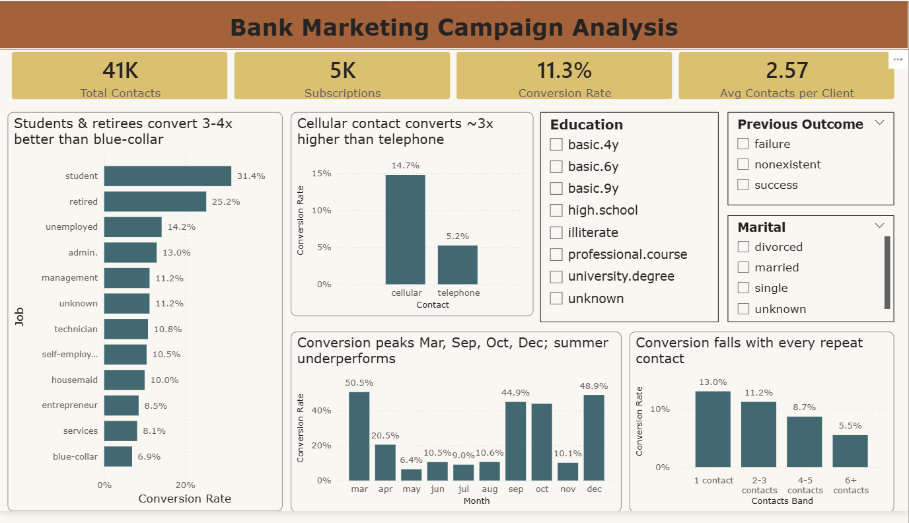
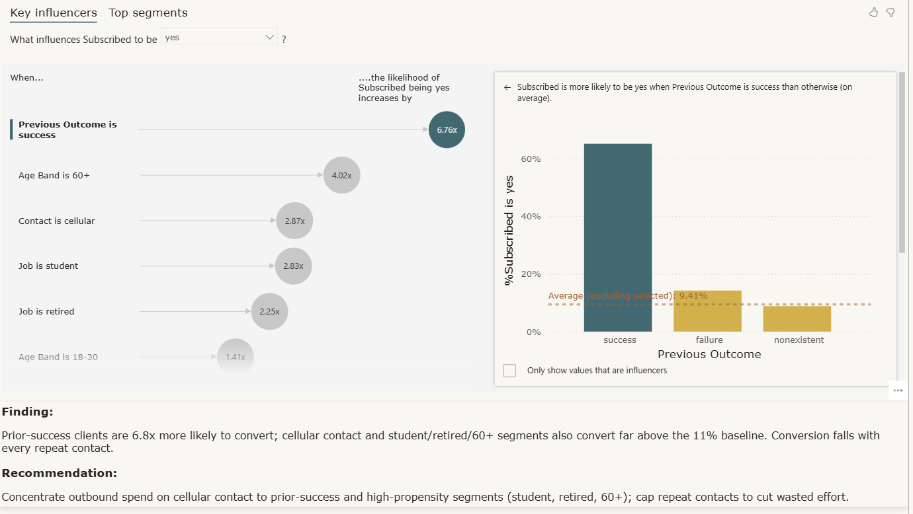

# Bank Marketing Campaign Analysis: Conversion & Targeting Dashboard

An interactive Power BI dashboard analysing 41,188 direct-marketing contacts from a Portuguese bank to answer a real business question: which customers and channels actually convert, and where should the bank focus its outbound spend?

**Key takeaway:** Cellular contact to prior-success clients is the smart-money strategy — it converts far above the ~11% baseline, while repeat-calling the same client wastes effort.

## Business Problem
The bank runs costly phone campaigns to sell term deposits, but most calls don't convert. This project turns 41,188 raw contact records into a clear, data-backed answer on **who to target and how to reach them** — so marketing spend goes where conversions actually happen.

## Objectives
- Identify what drives a subscription (channel, segment, prior outcome)
- Find where conversion concentrates across jobs, age, and seasons
- Compare conversion across contact methods and customer segments
- Highlight the highest-propensity segments for targeting
- Build an interactive dashboard for quick, filterable decision-making

## Tools & Skills
- **Microsoft Power BI:** Power Query, DAX measures, slicers, Key Influencers (AI) visual
- **Data cleaning:** sentinel handling (`pdays = 999`), data typing, calculated columns
- **Data visualisation:** KPI cards, bar/column/combo charts, AI Key Influencers
- **Dashboard design:** interactive filtering, layout, storytelling

## 📊 Dataset
- **Source:** Bank Marketing dataset (Portuguese bank) : UCI / Kaggle
- **Size:** 41,188 rows, 20 columns (incl. calculated), comma-delimited
- **Period:** 2008–2010 (no year field in the data — each row = one contact event)
- **Target:** `y` — did the client subscribe to a term deposit? (yes / no)

## Data Cleaning Performed
- Treated `pdays = 999` as a "not previously contacted" flag instead of a number, so averages weren't distorted
- Replaced the `999` sentinel with null after creating the flag
- Set correct data types across all 20 columns
- Added 3 calculated columns: `Age Band`, `Previously Contacted`, `Duration Bucket`
- Added a `MonthOrder` lookup table to fix calendar (Jan→Dec) sorting

## Key Insights
| # | Insight |
|---|---------|
| 1 | Channel drives conversion: cellular converts ~3× higher than telephone |
| 2 | Segment matters: retired and student clients convert well above average |
| 3 | Prior success is the strongest predictor: clients who subscribed before convert far more often |
| 4 | Low baseline: overall conversion is only ~11% across all contacts |
| 5 | Diminishing returns: conversion drops sharply after 3+ contacts to the same client |

## 💡 Recommendation
Concentrate outbound spend on **cellular contact** to **prior-success and high-propensity segments** (retired, student), and **cap repeat contacts** to cut wasted effort. Telephone-only outreach and heavy repeat-calling deliver the weakest returns.

## Dashboard Structure
| Component | Purpose |
|-----------|---------|
| Power Query (Bank) | Cleaned dataset + calculated columns |
| Data Model | `Bank` fact table + `MonthOrder` lookup |
| _Measures | All DAX measures powering the visuals |
| Campaign Overview | Interactive dashboard with KPIs, charts & slicers |

## Dashboard Features
- **4 KPI cards:** total contacts, subscriptions, conversion rate, avg call duration
- **5 visuals:** conversion by job, by month, by contact method, by duration bucket, and a Key Influencers AI visual
- **3 interactive slicers:** filter the entire dashboard by Marital Status, Education, and Prior Outcome

## Dashboard Preview
**Dashboard**

**Key Influencers**

## How to Use
1. Download `Bank_Marketing_Campaign_Analysis.pbix`
2. Open in **Power BI Desktop** (free; required for slicer interactivity)
3. Use the slicers on the Campaign Overview page to filter by marital status, education, or prior outcome
4. Read the plain-English chart titles and the recommendation text box for the key takeaways
